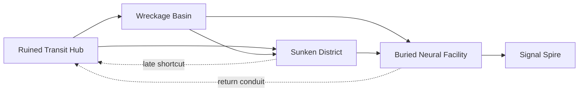

# Synaptrace Semi-Open World Foundation

This document is the world-construction specification for replacing the current mechanical prototype course with a cohesive semi-open 2D world. It began as the Phase 1 audit and now records the Phase 2 Ruined Transit Hub greybox implementation status. It is based on inspection of the real Unity project at `game/Synaptrace`.

The existing runtime-generated prototype remains the fallback until an authored replacement region is implemented, validated, and accepted.

## Verified Project Audit

### Unity version and main scene

Verified facts:

- Unity version is `6000.3.10f1`, from `game/Synaptrace/ProjectSettings/ProjectVersion.txt`.
- Phase 1 verified `Assets/Scenes/Main.unity` as the only enabled scene in `game/Synaptrace/ProjectSettings/EditorBuildSettings.asset`.
- Phase 2 keeps `Assets/Scenes/Main.unity` enabled first and adds `Assets/Scenes/RuinedTransitHub.unity` as an additional enabled scene.
- `Main.unity` serializes one root GameObject named `Game Systems`.
- `Game Systems` has `RuntimePrototypeBootstrapper` with `buildOnAwake: 1`.
- The prefab `game/Synaptrace/Assets/Prefabs/GameSystems.prefab` serializes the same bootstrapper component and no gameplay geometry.

Unknown without launching Unity:

- The currently open editor scene cannot be verified from repository files alone. The build settings identify `Assets/Scenes/Main.unity` as the playable main scene.

### Serialized scene content versus runtime content

Serialized in `Assets/Scenes/Main.unity`:

- Render, lightmap, navmesh, occlusion, and scene root settings.
- Root object `Game Systems`.
- `RuntimePrototypeBootstrapper` with `buildOnAwake` enabled.

Generated at runtime by `RuntimePrototypeBootstrapper`:

- Runtime sprites and hide-and-dont-save physics materials.
- Level hierarchy containers.
- Player GameObject, visual rig, `Rigidbody2D`, `BoxCollider2D`, `PlayerController`, and `PlayerVisualAnimator`.
- Start spawn point.
- Background simulation grid and gothic data-tower silhouettes.
- All platform colliders and their visual child sprites.
- Spike hazards and fall reset trigger.
- One corrupted sentinel enemy.
- Finish portal trigger.
- Main camera setup and `CameraFollow2D`.
- Runtime manager components added to `Game Systems`: `TelemetryTracker`, `DifficultyManager`, `GameManager`, `LevelManager`, and `PrototypeHUD`.

Recommendation:

- Phase 2 should introduce authored modular world objects without deleting the runtime bootstrap fallback. Keep the prototype scene, prefab, and menu rebuild path available until the new Ruined Transit Hub is playable and validated.

### Runtime prototype construction

`RuntimePrototypeBootstrapper` is marked with `[DefaultExecutionOrder(-1000)]` and builds in `Awake` when `buildOnAwake` is true. It first ensures game systems exist, then skips level construction if a `PlayerController` already exists.

The course is assembled from named runtime sections:

- `01 Intro Section`
- `02 Basic Jump Section`
- `03 First Hazard Introduction`
- `04 Wall Jump Tutorial Shaft`
- `05 Mixed Platform Hazard Section`
- `06 Optional Upper Route`
- `07 Final Vertical Climb`
- `08 Elevated Finish Area`

Every generated platform uses:

- `GameObject` on `Ground` layer.
- `BoxCollider2D`.
- No-friction runtime `PhysicsMaterial2D`.
- `SurfaceModifier` with default neutral settings.
- Procedural child sprites for panel visuals.

Hazards and goal volumes use trigger `BoxCollider2D` objects. Decorative runtime sprites are child renderers without colliders unless their parent object is a gameplay collider.

## Verified Player Configuration

Created by `RuntimePrototypeBootstrapper.CreatePlayer` and configured by `PlayerController.Awake`.

| Property | Verified value |
| --- | --- |
| Player GameObject name | `Player` |
| Layer | Default layer, because no player layer is assigned in code |
| Collider type | `BoxCollider2D` |
| Collider size | `0.78 x 1.18` Unity units |
| Collider offset | Default `0, 0`, because no offset is assigned |
| Rigidbody2D body type | Dynamic default, because no `bodyType` is assigned |
| Gravity scale | `3.2` |
| Interpolation | `RigidbodyInterpolation2D.Interpolate` |
| Constraints | `RigidbodyConstraints2D.FreezeRotation` |
| Collision detection mode | Default `Discrete`, because no `collisionDetectionMode` is assigned |
| Physics material | Runtime no-friction material, friction `0`, bounciness `0` |
| Ground mask used by controller | `1 << Ground`, layer index `6` |
| Project gravity | `(0, -9.81)` |
| Fixed timestep | `0.02` seconds |
| Physics2D contact offset | `0.01` |

## Verified Movement Parameters

| Category | Parameter | Verified value |
| --- | --- | --- |
| Ground movement | `moveSpeed` | `7` units/second |
| Ground movement | Acceleration | None. Horizontal velocity is assigned directly each `FixedUpdate`. |
| Air control | Standard air control | `1.0` multiplier when no wall surface modifier is active |
| Air control | Wall-surface air multiplier | From `SurfaceModifier.AirControlMultiplier`, default `1` |
| Gravity | Project gravity times player scale | `-9.81 * 3.2 = -31.392` units/second squared |
| Fall | `maxFallSpeed` | `-18` units/second |
| Ground jump | `jumpImpulse` | Vertical velocity set to `12` |
| Coyote time | None found | No coyote-time field or timer exists |
| Jump buffer | Minimal frame-to-physics request only | `jumpRequested` is set in `Update` and consumed in the next `FixedUpdate`; no timed buffer exists |
| Ground check | Offset | `(0, -0.58)` |
| Ground check | Size | `(0.68, 0.12)` |
| Wall check | Distance | `0.46` from player center |
| Wall check | Size | `(0.12, 0.88)` |
| Wall slide | Speed cap | `1.8` units/second downward, multiplied by surface modifier |
| Wall slide | Requirements | Airborne, touching Ground layer wall, pressing toward the wall, falling or stationary vertically, surface allows slide |
| Wall jump | Impulse | `(8.5, 11.5)` away from wall |
| Wall jump | Control lock | `0.16` seconds |
| Wall jump | Requirements | Airborne and either wall-sliding or touching a Ground layer wall; surface allows jump |
| Phase dodge | Speed | `11` units/second horizontal |
| Phase dodge | Duration | `0.22` seconds |
| Phase dodge | Cooldown | `0.8` seconds from start to start |
| Phase dodge | Collision effect | Does not bypass platforms, hazards, or fall reset; only enemy contact treats phasing as intangible/stunning |

## Measured Traversal Envelope

These values are derived from verified code and settings. They are theoretical physics maxima, not comfort targets. Mandatory world construction must apply margins and must be play-mode checked.

### Ordinary ground jump

Inputs:

- Initial vertical velocity: `12`.
- Horizontal speed: `7`.
- Gravity magnitude: `31.392`.
- Player collider width: `0.78`.
- Player collider height: `1.18`.

Derived values:

| Measurement | Value |
| --- | ---: |
| Maximum ordinary jump rise | `2.2936` units |
| Time to apex | `0.3823` seconds |
| Same-height flight time | `0.7645` seconds |
| Maximum same-height horizontal center travel | `5.3517` units |
| Maximum same-height empty gap, edge-perfect | `4.5717` units |
| Phase dodge travel distance | `2.42` units |

The previously cited limits of about `2.29` vertical and `5.35` horizontal are supported by the current implementation as mathematical same-height, perfect-input ground-jump limits. They must not be used as mandatory route targets.

Recommended Phase 2 construction limits:

- Mandatory ordinary jumps should stay at or below `70%` of theoretical same-height center travel unless playtests justify a tighter value.
- Same-height mandatory empty gaps should therefore start at or below `3.2` units, calculated from `4.5717 * 0.70`.
- Mandatory upward landings should leave at least `0.35` units below the theoretical vertical limit.
- Optional routes may be closer to the theoretical envelope, but each optional route must be intentionally reachable and labeled as optional in validation data.

For elevated landings, theoretical center travel decreases as landing height rises:

| Landing elevation above takeoff | Theoretical center travel | Theoretical empty gap after collider width |
| ---: | ---: | ---: |
| `0.0` | `5.3517` | `4.5717` |
| `0.5` | `5.0421` | `4.2621` |
| `1.0` | `4.6854` | `3.9054` |
| `1.5` | `4.2498` | `3.4698` |
| `2.0` | `3.6332` | `2.8532` |
| `2.29` | `2.7815` | `2.0015` |

Lower landings can extend airtime until the `-18` fall-speed clamp is reached. Do not rely on extended falling arcs for essential routes until they are measured in Play mode with the camera, hazards, and reset volumes active.

### Wall jump

Inputs:

- Initial wall-jump velocity: `(8.5, 11.5)`.
- Control lock: `0.16` seconds.
- After the lock, horizontal velocity returns to normal input-driven movement, normally `7` units/second if held away from the wall.

Derived values:

| Measurement | Value |
| --- | ---: |
| Wall-jump vertical rise | `2.1062` units |
| Wall-jump same-height flight time | `0.7327` seconds |
| Horizontal travel during locked impulse | `1.36` units |
| Same-height center travel with away input after lock | About `5.37` units |

Verified wall-detection behavior:

- Right-wall check center is `0.46` units right of the player center.
- Left-wall check center is `0.46` units left of the player center.
- Wall check width is `0.12`, so the query starts about `0.01` units outside the player collider edge and reaches about `0.13` units beyond it.
- Wall surfaces must be in the `Ground` layer mask.

Existing runtime shaft widths:

- Tutorial shaft inner width: `2.3` units between wall faces.
- Final shaft inner width: `2.0` units between wall faces.
- The current code comments intend raised entrances with `1.55` and `1.825` units of vertical clearance respectively, both exceeding the `1.18` player collider height.

Recommendation:

- Treat `2.0` units as the smallest currently designed wall-jump shaft width, not as a general minimum. Any narrower shaft requires Play-mode verification.
- Wall-jump routes should provide visible recovery ledges and should not depend on reversing input immediately after the `0.16` second lock.

## Existing Systems Relevant To World Construction

### Checkpoint and reset

Verified facts:

- There is a single `PlayerSpawnPoint` in the runtime prototype, named `Start Spawn`.
- Spawn position is `(-17.2, -1.42, 0)`.
- `LevelManager` caches the first `PlayerSpawnPoint` it finds and respawns the player there.
- Death disables controls, records telemetry, waits `0.75` seconds, then restarts.
- Manual restart uses `R` or the HUD button.
- `CreateFallResetZone` creates a trigger at `(8.7, -6.25, 0)` with size `64 x 0.7`.
- Fall reset is a `Hazard` configured with `countsAsHazardHit = false`.

Recommendation:

- Phase 2 should not add multi-checkpoint behavior until a stable checkpoint identity and activation flow is designed. For the first authored region, use one safe spawn/checkpoint and validate it with player-sized overlap checks.

### Camera

Runtime camera configuration:

- Position: `(-14.7, -0.2, -10)`.
- Orthographic: true.
- Orthographic size: `4.7`.
- Background color: dark blue-black.
- Follow offset: `(1.4, 1.2, -10)`.
- Follow speed: `6.5`.
- Clamp min: `(-14.7, -1.2)`.
- Clamp max: `(31.6, 5.9)`.

Risk:

- Current camera bounds are hard-coded around the runtime course. A semi-open world needs authored or computed camera bounds per region or zone without changing existing behavior until the new region is active.

### Enemy encounter logic

Current enemy:

- One runtime enemy named `Enemy 01 - Corrupted Sentinel`.
- Position: `(-1.7, -0.1, 0)`.
- Rigidbody2D: kinematic, interpolated, freeze rotation.
- Collider: trigger `BoxCollider2D`, size `0.8 x 0.9`.
- Patrol half distance: `0.85`.
- Patrol speed: `0.8`.
- Detection range: `2.4`.
- Vertical detection tolerance: `1.5`.
- Alert duration: `0.4`.
- Rush speed: `5.2`.
- Rush duration: `0.5`.
- Recovery duration: `0.8`.
- Phase stun duration: `1.2`.

Contact behavior:

- Normal player contact reports death through `LevelManager.RegisterPlayerDeath(enemyName, false)`.
- Phasing player contact disables the enemy trigger and stuns the enemy temporarily.

Unsupported today:

- Enemy health.
- Enemy accuracy telemetry.
- Damage taken telemetry.
- Per-zone encounter telemetry.

### Finish and portal logic

Current goal:

- `Finish Portal - Elevated Exit`.
- Position: `(36.9, 7.75, 0)`.
- Trigger size: `0.9 x 2.2`.
- Layer: `Goal`.
- `GoalZone.OnTriggerEnter2D` calls `LevelManager.CompleteLevel`.

### Telemetry

Current `LevelTelemetrySnapshot` fields:

- `levelId`
- `deathCount`
- `retryCount`
- `jumpCount`
- `dodgeCount`
- `hazardHitCount`
- `completionTime`
- `elapsedTime`
- `completed`
- `lastEvent`

Current telemetry events:

- `BeginLevel`
- `RecordJump`
- `RecordHazardHit`
- `RecordDodge`
- `RecordDeath`
- `RecordRetry`
- `RecordCompletion`

Missing for semi-open encounter research:

- Stable zone identifiers.
- Zone entry/exit events.
- Attempt start/end events.
- Abandonment/reset events by zone.
- Damage taken.
- Enemy attacks, shots, hits, misses, accuracy, or hit rate.
- Difficulty condition recorded per zone.
- File or database export.

### SurfaceModifier

`SurfaceModifier` is attached to generated platforms and currently defaults to `Standard` behavior:

- Movement speed multiplier: `1`.
- Air control multiplier: `1`.
- Ground jump multiplier: `1`.
- Wall-slide speed multiplier: `1`.
- Wall-jump horizontal multiplier: `1`.
- Wall-jump vertical multiplier: `1`.
- Allows wall slide: true.
- Allows wall jump: true.
- Contact friction: `0`.

Recommendations:

- Keep authored gameplay surfaces explicit and inspectable.
- Use surface modifiers for deliberate movement variants only after the base region validates with default surfaces.
- Do not use surface modifiers to hide geometry mistakes.

### Tags, layers, and physics

Verified tags and layers:

- No custom tags are serialized.
- Layer `6`: `Ground`.
- Layer `7`: `Hazard`.
- Layer `8`: `Goal`.
- Existing player is on `Default`.
- Current layer collision matrix is all enabled.
- `Physics2D.queriesHitTriggers` is enabled.
- `Physics2D.queriesStartInColliders` is enabled.

World-construction implication:

- Validation queries must explicitly filter layers and trigger interaction. If they use `Physics2D` defaults, trigger hazards and goal volumes may be included.

### Automated tests and validation utilities

Verified:

- No automated test folder, NUnit tests, or Unity Test Framework files were found under `game/Synaptrace/Assets`.
- Existing validation-style tooling is limited to `PrototypeSceneGenerator`, editor `ConfigureForEditor` helpers, and runtime gizmos for player ground/wall checks and enemy detection.

Recommendation:

- Phase 2 should add editor-time validation tooling before or alongside authored geometry, but not as part of this Phase 1 document-only step.

## World Premise And Visual Language

Synaptrace should become a seamless, semi-open 2D world in an original sun-scorched post-collapse setting. The tone can draw broad inspiration from high-contrast sci-fi ruins, but it must not copy any specific locations, enemies, names, layouts, or identifiable designs from existing games.

Core visual language:

- Desert-buried futuristic infrastructure.
- Ruined settlements and broken megastructure fragments.
- Sand, faded concrete, black metal, oxidized structural ribs, and exposed service cavities.
- Exposed cables, neural machinery, signal conduits, and biological-machine corruption.
- Fragmented holograms used as navigational and experimental signals.
- Gothic-tech accents such as spires, ribbed arches, reliquary-like machines, black fins, stained-metal silhouettes, and ritualized data markers.
- Cyan, signal green, and sharp magenta corruption energy against sand and concrete.

Gameplay readability rule:

- Cyan and signal-colored energy may mark route information, safe technology, interactable systems, checkpoints, and experimental instrumentation.
- Red or magenta corruption should be reserved for hazards, enemies, blocked paths, and unstable machinery.
- Decorative wreckage must not imply collision unless it is intentionally gameplay geometry.

## Semi-Open World Topology

The world is semi-open rather than fully unrestricted. It should feel continuous, but each region should still contain controlled encounter zones suitable for comparing static, rule-based, and reinforcement-learning-driven difficulty systems.

Topology contract:

- The Ruined Transit Hub is the central onboarding and routing anchor.
- Wreckage Basin and Sunken District provide early route choice, with different traversal emphasis.
- Buried Neural Facility is more constrained and supports high-pressure controlled encounter testing.
- Signal Spire is the final convergence and eventual boss route.
- Shortcuts should open after traversal mastery or region completion, but essential research encounters must remain reproducible.

## Region Responsibilities

| Region | Responsibility | Experimental role |
| --- | --- | --- |
| Ruined Transit Hub | Safe introduction, baseline movement calibration, route junction | Establish starting performance baseline with no mandatory combat |
| Wreckage Basin | Open traversal, movement expression, introductory combat | Measure mobility, enemy avoidance, phase use, and first combat performance |
| Sunken District | Vertical ruins, wall-jumping, alternate routes | Measure navigation execution, retries, route choice, and vertical traversal failure points |
| Buried Neural Facility | Constrained interiors and high-pressure encounters | Provide controlled adaptive-difficulty test zones |
| Signal Spire | Final convergence and later boss encounter | Evaluate accumulated adaptation and compare final-condition outcomes |

## Collision And Clearance Rules

### Required construction contract

- Gameplay geometry must use modular, independently collidable pieces.
- A visible doorway, tunnel, hole, shaft entrance, or route opening must be a real absence of collision geometry.
- Never place one large rectangular collider behind a wall that visually contains a passage.
- Do not use a hidden catch-all collider behind compound ruins if the visual design contains passable gaps.
- Decorative rubble, cables, vegetation, foreground wreckage, hologram shards, dust effects, and background machinery should be non-collidable unless explicitly marked as gameplay geometry.
- A `CompositeCollider2D`, if introduced later, must not bridge intended openings.
- Spawn points, checkpoints, encounter entrances, exits, and route stubs must be tested for player-sized overlaps.
- Every mandatory jump must remain inside the verified traversal envelope with a consistency margin.
- Optional routes may be more demanding, but they must remain intentionally reachable.
- No essential route may depend on pixel-perfect edge jumps, frame-perfect jump input, or exploiting fall-speed clamp behavior.
- One-way platforms are not currently supported by inspected gameplay code. Do not rely on one-way platforms in Phase 2 unless safe support is implemented and validated first.
- Preserve existing movement, Shift phase, enemy, camera, checkpoint, reset, HUD, and telemetry behavior while introducing the new world.

### Clearance measurements

Verified player body:

- Collider width: `0.78`.
- Collider height: `1.18`.
- Half width: `0.39`.
- Half height: `0.59`.
- Physics2D default contact offset: `0.01`.

Derived absolute non-overlap clearance:

- Raw opening width should be at least `0.80` units, calculated as `0.78 + 2 * 0.01`.
- Raw opening height should be at least `1.20` units, calculated as `1.18 + 2 * 0.01`.

Recommended construction standards for authored world pieces:

- Standard horizontal passage clear width: `1.20` units or greater. This gives `0.21` units of side margin around the verified collider.
- Standard doorway or low tunnel clear height: `1.55` units or greater. This matches the smallest intended raised-shaft entry clearance in the current runtime course and gives `0.37` units over the collider height.
- Wall-jump shaft inner width: start from the verified current range of `2.0` to `2.3` units. Narrower shafts require Play-mode verification.
- Mandatory ordinary-jump landing platform width: `1.5` units or greater. This matches the smallest current optional-route platform width and is wider than the `0.78` collider.
- Main-route ordinary-jump landing platform width: prefer `2.0` units or greater, matching the current basic jump pads.
- Wall-climb catch ledges: the current prototype uses ledges as narrow as `0.9` units. Treat this as a verified existing dimension but require Play-mode verification before using it on a mandatory new route.
- Spawn/checkpoint center height above standing surface: current spawn uses floor top plus about `0.605` units, which is player half-height `0.59` plus `0.015`. Reuse this convention unless changed in code.
- Spawn/checkpoint free volume: validate at least the player collider size plus `0.10` units horizontal and vertical margin, excluding the intended standing surface below.

## Ruined Transit Hub Greybox Blueprint

Phase 2 implements this as a separate authored greybox scene at `game/Synaptrace/Assets/Scenes/RuinedTransitHub.unity`, generated through Unity Editor APIs by `RuinedTransitHubSceneGenerator`. `Main.unity` remains the runtime prototype fallback and still owns the original bootstrap path.

Coordinate convention:

- Use local region coordinates in Unity units.
- Put the Ruined Transit Hub baseline floor around `y = 0`.
- Use `TransitHub_Spawn` as local `x = 0`.
- Positions below are the generated object centers in the authored scene.
- Bounds and gap measurements are derived from generated `BoxCollider2D` bounds.
- Automated editor validation has passed. Play-mode traversal remains manually outstanding unless recorded in the Phase 2 status section.

Design goals:

- Safe spawn and first checkpoint.
- Short movement calibration path with no mandatory combat.
- A real wall opening that the full player collider can traverse.
- One small ordinary jump comfortably inside the verified envelope.
- Optional elevated route for early mastery signal.
- Central transit chamber with three visually distinct route exits or stubs.
- One open route stub toward Wreckage Basin.
- Locked or incomplete placeholders for later regions.
- Early return/shortcut that does not skip required baseline measurement.
- Clear separation between gameplay collision and decoration.

Implemented greybox objects:

| Stable object name | Purpose | Generated position | Dimensions | Collider type | Traversal role | Geometry or decoration |
| --- | --- | --- | --- | --- | --- | --- |
| `TransitHub_Root` | Region root and stable parent | `(0, 0, 0)` | n/a | None | Organization | Decoration/metadata |
| `TransitHub_Spawn` | Safe player spawn | `(0, 0.605, 0)` | gizmo `0.98 x 1.38` validation volume | None | Start/checkpoint | Metadata |
| `THub_Geo_SpawnCalibrationFloor` | Stable floor under spawn and calibration runway | `(2.5, -0.275, 0)` | `7.0 x 0.55`; bounds x `-1.0..6.0`, top y `0.0` | `BoxCollider2D` | Safe start runway | Gameplay geometry |
| `THub_Geo_DoorPassageFloor` | Continuous walkable floor under doorway | `(8.5, -0.275, 0)` | `5.0 x 0.55`; bounds x `6.0..11.0`, top y `0.0` | `BoxCollider2D` | Horizontal pass-through | Gameplay geometry |
| `THub_Geo_DoorOverheadHeader` | Overhead wall/header above the passage | `(8.5, 1.875, 0)` | `2.8 x 0.45`; lower face y `1.65` | `BoxCollider2D` | Low tunnel clearance | Gameplay geometry |
| `THub_Opening_MainDoor` | Validation-only doorway clearance | Cast `(6.65, 0.605)` to `(10.35, 0.605)` | Body cast `0.78 x 1.18`; margin cast `0.98 x 1.38`; minimum vertical clearance `1.55` | None | Pass-through opening | Metadata |
| `THub_Geo_SmallJumpTakeoff` | Takeoff side of small ordinary jump | `(11.9, -0.275, 0)` | `1.8 x 0.55`; bounds x `11.0..12.8`, top y `0.0` | `BoxCollider2D` | Mandatory small jump setup | Gameplay geometry |
| `THub_Geo_SmallJumpLanding` | Landing side of small ordinary jump | `(15.1, 0.05, 0)` | `2.2 x 0.55`; bounds x `14.0..16.2`, top y `0.325` | `BoxCollider2D` | Mandatory small jump landing | Gameplay geometry |
| `THub_Link_MandatorySmallJump` | Validation metadata for mandatory jump | n/a | Expected gap `1.20`; expected rise `0.325`; takeoff min `1.8`; landing min `2.2` | None | Mandatory jump validation | Metadata |
| `THub_Geo_ChamberFloor` | Central transit chamber floor | `(20.0, 0.05, 0)` | `7.6 x 0.55`; bounds x `16.2..23.8`, top y `0.325` | `BoxCollider2D` | Central hub | Gameplay geometry |
| `THub_Geo_BasinExitFloor` | Open exit stub toward Wreckage Basin | `(25.9, 0.05, 0)` | `4.2 x 0.55`; bounds x `23.8..28.0`, top y `0.325` | `BoxCollider2D` | Primary outbound route stub | Gameplay geometry |
| `THub_Geo_WreckageStubTerminalBlocker` | Visible terminal blocker before unimplemented Basin space | `(28.25, 1.225, 0)` | `0.5 x 1.8` | `BoxCollider2D` | Safe route-stub end | Gameplay geometry |
| `THub_Geo_SunkenDistrictLockedGate` | Visible locked blocker for later Sunken District route | `(21.95, 1.225, 0)` | `0.45 x 1.8` | `BoxCollider2D` | Locked placeholder | Gameplay geometry |
| `THub_Geo_NeuralFacilitySealedBulkhead` | Visible sealed blocker for later Buried Neural Facility route | `(18.05, 1.225, 0)` | `0.45 x 1.8` | `BoxCollider2D` | Sealed placeholder | Gameplay geometry |
| `THub_Geo_OptionalLiftBase` | Start of optional elevated route | `(17.4, 0.725, 0)` | `1.5 x 0.4`; top y `0.925` | `BoxCollider2D` | Optional route entry | Gameplay geometry |
| `THub_Geo_OptionalLedgeA` | Optional elevated hop | `(19.6, 1.325, 0)` | `1.6 x 0.4`; top y `1.525` | `BoxCollider2D` | Optional route | Gameplay geometry |
| `THub_Geo_OptionalLedgeB` | Optional elevated hop | `(21.8, 1.725, 0)` | `1.7 x 0.4`; top y `1.925` | `BoxCollider2D` | Optional route | Gameplay geometry |
| `THub_Geo_OptionalRejoinDrop` | Optional route rejoin above central exit side | `(23.35, 0.725, 0)` | `1.5 x 0.4`; top y `0.925` | `BoxCollider2D` | Optional rejoin/drop | Gameplay geometry |
| `THub_Zone_IntroCalibration` | Baseline intro zone trigger | `(7.4, 0.8, 0)` | `12.8 x 1.5`; bottom y `0.05` | Trigger `BoxCollider2D` | Zone metadata only | Metadata |
| `THub_Zone_IntroComplete` | Trigger after mandatory jump | `(15.1, 1.0, 0)` | `2.2 x 1.2`; bottom y `0.4` | Trigger `BoxCollider2D` | Baseline completion marker later | Metadata |
| `THub_Zone_CentralChamber` | Central chamber zone trigger | `(20.0, 0.65, 0)` | `3.0 x 0.5`; bottom y `0.4` | Trigger `BoxCollider2D` | Zone metadata only | Metadata |
| `THub_Route_WreckageBasin` | Open route stub toward Wreckage Basin | `(26.6, 0.65, 0)` | `1.6 x 0.5`; bottom y `0.4` | Trigger `BoxCollider2D`; no `GoalZone` | Route metadata only | Metadata |
| `THub_Route_SunkenDistrictLocked` | Locked route marker | `(21.25, 0.65, 0)` | `0.9 x 0.5`; bottom y `0.4` | Trigger `BoxCollider2D` | Later route | Metadata |
| `THub_Route_NeuralFacilitySealed` | Sealed route marker | `(18.75, 0.65, 0)` | `0.9 x 0.5`; bottom y `0.4` | Trigger `BoxCollider2D` | Later route | Metadata |
| `THub_Hazard_FallReset` | Fall reset coverage beneath hub | `(13.6, -4.2, 0)` | `31.0 x 0.7` | Trigger `BoxCollider2D` on `Hazard`; `Hazard.countsAsHazardHit = false` | Reset safety net | Metadata/system |
| `Main Camera` | Hub-scoped camera | `(2.3, 1.25, -10)` | Orthographic size `4.7`; offset `(1.4, 1.2, -10)`; clamp min `(1.4, 0.7)`, max `(25.5, 2.8)` | None | Camera follow | System |
| `Game Systems` | One manager set | scene root | n/a | None | HUD, telemetry, difficulty, level lifecycle | System |
| `THub_Deco_*` objects | Greybox-only route silhouettes and signs | generated per object | visual sprites only | None | Visual distinction | Decoration |

Blueprint validation notes:

- The main doorway is not constructed from collidable side piers. It is continuous floor beneath overhead geometry.
- The generated overhead header lower face is `1.65` units above the baseline floor, exceeding the `1.55` minimum.
- The opening is checked by horizontal `BoxCast` using both the full player body and the documented safety-margin volume.
- There must be no single hidden collider behind the passage and no collider occupying the swept opening except the intended supporting floor.
- The mandatory small jump uses exactly `1.20` units of empty edge-to-edge gap and `0.325` units of upward landing in generated collider bounds.
- The optional elevated route uses small rises under `1.0` unit and should be reachable without wall jumping.
- The Wreckage Basin exit should be visibly open but can lead to a short blocked stub until the Basin exists.
- Locked placeholders for Sunken District and Buried Neural Facility should communicate later access without pretending to be passable holes.

Implemented stable IDs:

- Region: `ruined_transit_hub`.
- Zones: `hub_intro_calibration`, `hub_intro_complete`, `hub_central_chamber`.
- Opening: `opening_hub_main_door`.
- Mandatory traversal link: `link_hub_intro_small_jump`.
- Optional traversal links: `link_hub_optional_elevated_a`, `link_hub_optional_elevated_b`, `link_hub_optional_elevated_c`, `link_hub_optional_elevated_rejoin`.
- Routes: `route_hub_to_wreckage_basin`, `route_hub_to_sunken_district`, `route_hub_to_neural_facility`.
- Spawn/reset: `spawn_hub_intro`, `hazard_hub_fall_reset`.

## RL Encounter-Zone Contract

Do not implement or redesign the RL agent in Phase 1. The world should prepare clean boundaries and stable hooks so static, rule-based, and RL-driven conditions can be compared later.

Each controlled encounter zone should expose:

- Stable zone identifier, for example `hub_intro_calibration`, `basin_combat_01`, or `facility_pressure_02`.
- Region identifier.
- Entry trigger and exit trigger.
- Attempt-start trigger or explicit attempt state.
- Death/retry event.
- Abandonment/reset event, including manual restart, backtracking exit, or timeout if later defined.
- Successful-completion event.
- Time spent in zone.
- Damage taken, once health or damage exists.
- Enemy hit-rate or accuracy data where supported by enemy logic.
- Difficulty condition: `Static`, `RuleBased`, or `ReinforcementLearning`.
- Optional route flag.
- Mandatory route flag.

World-side design boundaries:

- Geometry should not know about a specific RL agent.
- Zones should emit neutral events and metrics that adapters can consume.
- Difficulty condition should be read from an adaptation manager or experiment configuration, not hard-coded into colliders.
- Route gates and encounters should have stable IDs even if visuals or geometry move.
- Encounter zones should be reproducible: same entry point, same bounds, same completion rule, same reset rule.
- Zone triggers should be separate from solid gameplay geometry.

Current support mapping:

| Required data | Current support | Phase 2 implication |
| --- | --- | --- |
| Stable level identifier | `LevelManager.levelId` exists, default `Prototype-01` | Add zone-level identifiers later |
| Entry event | Level start exists | Add zone enter events |
| Attempt start | Level start/retry exists | Add zone attempt state |
| Death/retry | Supported at level scope | Add zone attribution |
| Abandonment/reset | Manual retry exists, no abandonment classification | Add reasoned zone reset event |
| Successful completion | Goal completion exists | Add zone completion triggers |
| Time spent | Level elapsed/completion time exists | Add per-zone timers |
| Damage taken | Not supported | Add only after damage model exists |
| Enemy accuracy/hit rate | Not supported | Add only after enemies expose attacks/hits/misses |
| Difficulty condition | `DifficultyManager.CurrentMode` exists | Record condition per zone when telemetry is extended |

## Proposed Validation Tooling

Add editor-time validation in a later implementation phase. Prefer collider queries, casts, and Scene-view gizmos.

Recommended components and assets:

- `WorldZoneDefinition`: stable region ID, zone ID, optional/mandatory flag, entry trigger, exit trigger, completion rule, and difficulty condition source.
- `WorldValidationProfile`: player collider size, clearance margin, mandatory jump margin, landing width requirement, allowed gameplay layers, allowed trigger layers.
- `WorldValidationRunner`: editor utility that scans the active scene or selected region root and produces a report.
- `WorldValidationGizmos`: visible Scene-view overlays for tested openings, route arcs, blocked samples, spawn volumes, and zone IDs.

Automatic checks:

- Player-sized clearance through intended openings using `Physics2D.BoxCast` or sampled `Physics2D.OverlapBox` queries with the measured player size plus margin.
- Spawn and checkpoint overlap using `Physics2D.OverlapBox`, excluding the intended floor contact below.
- Mandatory route reachability against the measured jump envelope.
- Landing-width requirements by measuring platform surface width or checking authored metadata against collider bounds.
- Accidental collider bridges across intended openings by sweeping a clearance box through the opening volume.
- Blocking decoration by checking colliders on objects marked or parented as decoration.
- Encounter trigger entry and exit presence.
- Missing stable zone identifiers.
- Duplicate stable zone identifiers.
- Trigger volumes that overlap solid geometry unexpectedly.
- Composite collider geometry crossing intended openings, if `CompositeCollider2D` is introduced.

Manual Play-mode checks still required:

- Feel and consistency of mandatory jumps.
- Wall-jump route comfort, especially input timing after the `0.16` second lock.
- Camera framing and clamp behavior.
- Enemy readability and phase timing.
- Checkpoint restart feel.
- HUD readability and telemetry sanity.
- Whether decorative silhouettes imply false collision.
- Any route that relies on falling below takeoff height.

## Incremental Migration Plan

1. Preserve the current runtime prototype scene and `RuntimePrototypeBootstrapper` as fallback.
2. Add validation metadata types and editor-only validation tools without changing player movement.
3. Create an authored Ruined Transit Hub scene or region prefab with modular colliders and non-colliding decoration.
4. Keep the initial hub free of mandatory combat.
5. Validate spawn, doorway, small jump, optional elevated route, central chamber, and route stubs.
6. Add zone metadata and neutral telemetry hooks for hub baseline measurement.
7. Run Play-mode verification of hub traversal and reset behavior.
8. Only after the hub is accepted, begin Wreckage Basin route implementation.
9. Keep build settings or scene selection arranged so the prototype remains accessible until the authored world is stable.
10. Move from runtime procedural visuals to authored sprites/prefabs gradually, preserving collider dimensions and movement behavior.

## Architectural Risks

- The current playable course is generated in `Awake`; authored scene objects and runtime generation could conflict if both create players or managers.
- `RuntimePrototypeBootstrapper` skips level construction only if a `PlayerController` already exists, so Phase 2 must explicitly decide which bootstrap path is active.
- `PrototypeSceneGenerator` can rebuild `Main.unity` and overwrite authored scene content if used incorrectly.
- Camera bounds are hard-coded for the prototype.
- Telemetry is level-scoped and in-memory only.
- Phase 1 found no automated tests. Phase 2 adds focused EditMode validation tests, but the local batch test runner did not emit a result XML in this environment.
- No stable zone identity system exists.
- No one-way platform support was found.
- The current layer collision matrix allows all layer pairs, so future triggers and decoration colliders need deliberate filtering.
- Generated platform styling couples visuals to collider parents; authored art must keep gameplay colliders inspectable.
- Wall-jump reach depends on post-lock player input and should be validated in Play mode, not accepted from formulas alone.

## Acceptance Criteria For Phase 2

Phase 2 should be considered acceptable only when:

- No existing movement, Shift phase, enemy, camera, checkpoint, reset, HUD, or telemetry behavior has been unintentionally changed.
- The original runtime prototype remains available as fallback.
- Ruined Transit Hub is implemented with modular independently collidable gameplay pieces.
- Every visible opening in the hub is a real absence of collision geometry.
- No hidden rectangular collider blocks or bridges a visible passage.
- Decoration is non-collidable unless explicitly marked as gameplay geometry.
- Spawn and checkpoint volumes pass overlap validation.
- The main doorway passes player-sized clearance validation.
- Mandatory jumps stay inside the measured traversal envelope with margin.
- Optional route reachability is validated and clearly marked optional.
- Central chamber and route stubs have stable identifiers.
- The Wreckage Basin route stub is prepared but not dependent on unimplemented regions.
- Locked placeholders for later regions are visibly distinct and do not pretend to be passable.
- Editor validation reports no duplicate zone IDs.
- Play-mode verification confirms traversal, camera framing, restart flow, and telemetry sanity.

## Unknowns Requiring Unity Play-Mode Verification

- Whether the exact current spawn height convention remains best once authored ground pieces replace runtime pieces.
- Doorway comfort through the generated `1.65` vertical-clearance low passage.
- The practical consistency margin for mandatory jumps under human input.
- Wall-jump shaft comfort for new authored surfaces.
- Camera behavior in a larger semi-open region.
- Interaction between future zone triggers and current hazard/goal trigger queries.
- Whether authored decorative sprites create misleading collision expectations.
- Whether future tilemap or composite-collider workflows preserve openings correctly.
- Exact telemetry event ordering once zone events are added.
- Whether enemy encounter metrics can be added without changing current enemy contact behavior.

## Phase 2 Implementation And Validation Status

Architecture chosen:

- `Assets/Scenes/Main.unity` remains the prototype fallback, enabled first in build settings.
- `Assets/Scenes/RuinedTransitHub.unity` is a separate authored greybox scene, enabled after `Main.unity`.
- The hub scene intentionally contains no `RuntimePrototypeBootstrapper`, so it does not generate the prototype course.
- The hub scene contains exactly one generated player, one generated camera, one `PlayerSpawnPoint`, and one manager set.
- The player object uses the verified prototype collider and movement setup: `BoxCollider2D` size `0.78 x 1.18`, offset `0, 0`, `Rigidbody2D.gravityScale = 3.2`, interpolation enabled, freeze rotation, default discrete collision detection, and no-friction player material from `PlayerController.Awake`.
- Gameplay geometry uses modular `THub_Geo_` `BoxCollider2D` objects on the existing `Ground` layer with neutral `SurfaceModifier`.
- Decoration uses `THub_Deco_` objects and contains no colliders or rigidbodies.
- Route metadata, opening metadata, traversal metadata, and triggers are separate from solid geometry.

Implemented scene and tooling:

- Scene generator: `game/Synaptrace/Assets/Scripts/Editor/RuinedTransitHubSceneGenerator.cs`.
- Editor validator: `game/Synaptrace/Assets/Scripts/Editor/RuinedTransitHubValidator.cs`.
- Runtime metadata types: `game/Synaptrace/Assets/Scripts/World/WorldStableId.cs`, `WorldZoneDefinition.cs`, `WorldOpeningDefinition.cs`, `WorldTraversalLinkDefinition.cs`, and `WorldRouteDefinition.cs`.
- Focused EditMode tests: `game/Synaptrace/Assets/Tests/EditMode/Editor/RuinedTransitHubValidationTests.cs`.
- Menu items: `Synaptrace/World/Generate Ruined Transit Hub` and `Synaptrace/World/Validate Ruined Transit Hub`.
- Batch methods: `Synaptrace.EditorTools.RuinedTransitHubSceneGenerator.GenerateSceneBatch` and `Synaptrace.EditorTools.RuinedTransitHubValidator.ValidateSceneBatch`.

Automated validation result:

- Unity `6000.3.10f1` batch generation succeeded.
- `RuinedTransitHubValidator` reported `[Synaptrace Hub Validation] Passed with 0 warning(s).`
- The validator checks singleton player/camera/spawn/managers, fallback build settings, absence of `RuntimePrototypeBootstrapper`, duplicate or missing stable IDs, spawn clearance with only the intended supporting floor excepted, doorway body and margin `BoxCast`, mandatory gap/rise, landing widths, optional-route rise flags, continuous-floor seams, decoration colliders/rigidbodies, gameplay collider layers, trigger/solid overlap, route triggers and terminal blockers, and absence of `CompositeCollider2D`.
- The doorway blocker negative case is represented by an EditMode test that inserts `THub_Geo_TemporaryDoorwayBlocker` and expects a doorway validation error.

Compilation and test-runner status:

- Unity imported and compiled the added scripts during batch execution.
- Unity Test Framework `1.6.0` is present in the project.
- Focused EditMode tests were added without installing packages.
- Batch `-runTests -testPlatform EditMode` launched and compiled, but did not emit `Logs/RuinedTransitHubEditModeTests.xml` or report executed tests in the local log. Treat the test-runner result as inconclusive, not passing.

Play-mode validation status:

- Unity was launched in batch mode for generation, compilation, and editor validation.
- Unity Play mode was not entered, and no PlayMode test successfully ran.
- The following remain manual Play-mode checks: spawn overlap in actual play, walking through the doorway both directions at normal speed, completing the mandatory jump, traversing and rejoining the optional route, reaching all three route stubs, manual restart, fall reset, camera follow/bounds, HUD behavior, telemetry begin/retry/jump/dodge events, and verifying `Main.unity` still runs its original runtime course.

Phase 2 non-goals preserved:

- No Wreckage Basin geometry was implemented beyond the safe route stub and terminal blocker.
- No enemies, mandatory combat, finished environmental art, RL implementation, or zone-level telemetry expansion were added.
- No one-way platforms or `CompositeCollider2D` objects were introduced.
- No packages were installed or updated.

## Phase 1 Validation Notes

This document was produced without launching Unity and without changing scenes, prefabs, gameplay scripts, project settings, or packages. All numeric movement and collider claims above were checked against inspected repository files or directly derived from those verified values.

Inspected source files include:

- `game/Synaptrace/ProjectSettings/ProjectVersion.txt`
- `game/Synaptrace/ProjectSettings/EditorBuildSettings.asset`
- `game/Synaptrace/ProjectSettings/Physics2DSettings.asset`
- `game/Synaptrace/ProjectSettings/TimeManager.asset`
- `game/Synaptrace/ProjectSettings/TagManager.asset`
- `game/Synaptrace/Assets/Scenes/Main.unity`
- `game/Synaptrace/Assets/Prefabs/GameSystems.prefab`
- `game/Synaptrace/Assets/Scripts/Core/RuntimePrototypeBootstrapper.cs`
- `game/Synaptrace/Assets/Scripts/Editor/PrototypeSceneGenerator.cs`
- `game/Synaptrace/Assets/Scripts/Player/PlayerController.cs`
- `game/Synaptrace/Assets/Scripts/Player/PlayerVisualAnimator.cs`
- `game/Synaptrace/Assets/Scripts/Core/LevelManager.cs`
- `game/Synaptrace/Assets/Scripts/Core/GameManager.cs`
- `game/Synaptrace/Assets/Scripts/Core/PlayerSpawnPoint.cs`
- `game/Synaptrace/Assets/Scripts/Systems/SurfaceModifier.cs`
- `game/Synaptrace/Assets/Scripts/Systems/Hazard.cs`
- `game/Synaptrace/Assets/Scripts/Systems/GoalZone.cs`
- `game/Synaptrace/Assets/Scripts/Systems/CameraFollow2D.cs`
- `game/Synaptrace/Assets/Scripts/Enemies/RushEnemyController.cs`
- `game/Synaptrace/Assets/Scripts/Telemetry/TelemetryTracker.cs`
- `game/Synaptrace/Assets/Scripts/UI/PrototypeHUD.cs`
- `game/Synaptrace/Assets/Scripts/AI/DifficultyManager.cs`
- `game/Synaptrace/Assets/Scripts/AI/DifficultyProfile.cs`
- `docs/unity-prototype-foundation.md`
- `game/Synaptrace/Assets/Documentation/PrototypeFoundation.md`
